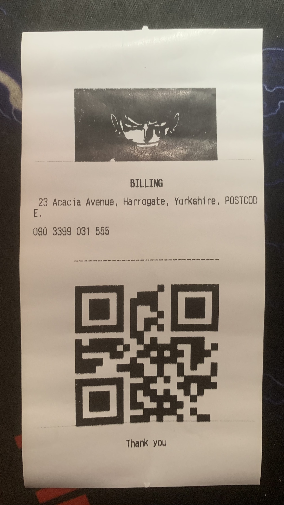
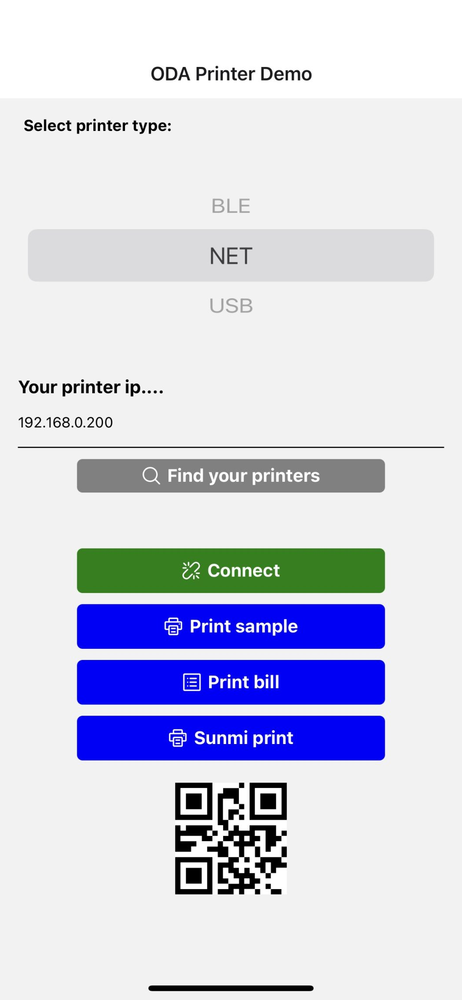

# react-native-thermal-receipt-printer-image-qr

- I fork this for my quickly project print with NET(android & ios) and USB(android).
Bluetooth is not implement. Just using old structure (ios & android).
- Fork of `react-native-thermal-receipt-printer` and add implement :
    + Ios: :heavy_check_mark:
    + Android: :heavy_check_mark:
    + Fix cut:heavy_check_mark:
    + Print With Column :heavy_check_mark:

<div style="display: flex; flex-direction: row; align-self: center; align-items: center">


</div>

## Installation
- add this line to the dependencies of package.json
```
react-native-thermal-receipt-printer-image-qr : "https://github.com/thiendangit/react-native-thermal-receipt-printer-image-qr.git"
```
```
yarn install
```

## Troubleshoot

- when install in `react-native` version >= 0.60, xcode show this error

```
duplicate symbols for architecture x86_64
```

that because the .a library uses [CocoaAsyncSocket](https://github.com/robbiehanson/CocoaAsyncSocket) library and Flipper uses it too

_Podfile_

```diff
...
  use_native_modules!

  # Enables Flipper.
  #
  # Note that if you have use_frameworks! enabled, Flipper will not work and
  # you should disable these next few lines.
  # add_flipper_pods!
  # post_install do |installer|
  #   flipper_post_install(installer)
  # end
...
```

and comment out code related to Flipper in `ios/AppDelegate.m`

## Support

| Printer    | Android            | IOS                |
| ---------- | ------------------ | ------------------ |
| USBPrinter | :heavy_check_mark: |                    |
| BLEPrinter | :heavy_check_mark: | :heavy_check_mark: |
| NetPrinter | :heavy_check_mark: | :heavy_check_mark: |

## Predefined tag
| Tags          | Description           |
|:-------------:|:---------------------:|
| C             | Center                |
| D             | Medium font           |
| B             | Large font            |
| M             | Medium font           |
| CM            | Medium font, centered |
| CB            | Medium font, centered |
| CD            | Large font, centered  |

## Development workflow

To get started with the project, run `yarn bootstrap` in the root directory to install the required dependencies for each package:

```sh
yarn bootstrap
```

While developing, you can run the [example app](/example/) to test your changes.

To start the packager:

```sh
yarn example start
```

To run the example app on Android:

```sh
yarn example dev-android
```

To run the example app on iOS:

```sh
yarn example ios
```

## Usage

```javascript
import {
  USBPrinter,
  NetPrinter,
  BLEPrinter,
} from "react-native-thermal-receipt-printer-image-qr";

USBPrinter.printText("<C>sample text</C>");
USBPrinter.printBill("<C>sample bill</C>");
let orderList = [
    ["1. Skirt Palas Labuh Muslimah Fashion", "x2", "500$"],
    ["2. BLOUSE ROPOL VIRAL MUSLIMAH FASHION", "x4", "500$"],
    ["3. Women Crew Neck Button Down Ruffle Collar Loose Blouse", "x1", "3000$"],
    ["4. Retro Buttons Up Full Sleeve Loose", "x10", "200$"],
];
let columnAliment = [ColumnAliment.LEFT, ColumnAliment.CENTER, ColumnAliment.RIGHT];
let columnWidth = [46 - (7 + 12), 7, 12]
for (let i in orderList) {
    USBPrinter.printColumnsText(orderList[i], columnWidth, columnAliment);
}
```

## Example

### USBPrinter (only support android)

```typescript
interface IUSBPrinter {
  device_name: string;
  vendor_id: number;
  product_id: number;
}
```

```javascript
  const [printers, setPrinters] = useState([]);
  const [currentPrinter, setCurrentPrinter] = useState();

  useEffect = () => {
    if(Platform.OS == 'android'){
      USBPrinter.init().then(()=> {
        //list printers
        USBPrinter.getDeviceList().then(setPrinters);
      })
    }
  }

  const _connectPrinter = (printer) => USBPrinter.connectPrinter(printer.vendorID, printer.productId).then(() => setCurrentPrinter(printer))

  const printTextTest = () => {
    currentPrinter && USBPrinter.printText("<C>sample text</C>\n");
  }

  const printBillTest = () => {
    currentPrinter && USBPrinter.printBill("<C>sample bill</C>");
  }

  ...

  return (
    <View style={styles.container}>
      {
        printers.map(printer => (
          <TouchableOpacity key={printer.device_id} onPress={() => _connectPrinter(printer)}>
            {`device_name: ${printer.device_name}, device_id: ${printer.device_id}, vendor_id: ${printer.vendor_id}, product_id: ${printer.product_id}`}
          </TouchableOpacity>
          ))
      }
      <TouchableOpacity onPress={printTextTest}>
        <Text>Print Text</Text>
      </TouchableOpacity>
      <TouchableOpacity onPress={printBillTest}>
        <Text>Print Bill Text</Text>
      </TouchableOpacity>
    </View>
  )

  ...

```

### BLEPrinter

```typescript
interface IBLEPrinter {
  device_name: string;
  inner_mac_address: string;
}
```

```javascript
  const [printers, setPrinters] = useState([]);
  const [currentPrinter, setCurrentPrinter] = useState();

  useEffect(() => {
    BLEPrinter.init().then(()=> {
      BLEPrinter.getDeviceList().then(setPrinters);
    });
  }, []);

  _connectPrinter => (printer) => {
    //connect printer
    BLEPrinter.connectPrinter(printer.inner_mac_address).then(
      setCurrentPrinter,
      error => console.warn(error))
  }

  printTextTest = () => {
    currentPrinter && USBPrinter.printText("<C>sample text</C>\n");
  }

  printBillTest = () => {
    currentPrinter && USBPrinter.printBill("<C>sample bill</C>");
  }

  ...

  return (
    <View style={styles.container}>
      {
        this.state.printers.map(printer => (
          <TouchableOpacity key={printer.inner_mac_address} onPress={() => _connectPrinter(printer)}>
            {`device_name: ${printer.device_name}, inner_mac_address: ${printer.inner_mac_address}`}
          </TouchableOpacity>
          ))
      }
      <TouchableOpacity onPress={printTextTest}>
        <Text>Print Text</Text>
      </TouchableOpacity>
      <TouchableOpacity onPress={printBillTest}>
        <Text>Print Bill Text</Text>
      </TouchableOpacity>
    </View>
  )

  ...

```

### NetPrinter

```typescript
interface INetPrinter {
  device_name: string;
  host: string;
  port: number;
}
```

_Note:_ get list device for net printers is support scanning in local ip but not recommended

```javascript
  const EscPosEncoder = require('esc-pos-encoder')
  import {Buffer} from 'buffer';

  componentDidMount = () => {
    NetPrinter.init().then(() => {
      this.setState(Object.assign({}, this.state, {printers: [{host: '192.168.10.241', port: 9100}]}))
      })
  }

  _connectPrinter => (host, port) => {
    //connect printer
    NetPrinter.connectPrinter(host, port).then(
      (printer) => this.setState(Object.assign({}, this.state, {currentPrinter: printer})),
      error => console.warn(error))
}

  printTextTest = () => {
    if (this.state.currentPrinter) {
      NetPrinter.printText("<C>sample text</C>\n");
      NetPrinter.printImage("https://sportshub.cbsistatic.com/i/2021/04/09/9df74632-fde2-421e-bc6f-d4bf631bf8e5/one-piece-trafalgar-law-wano-anime-1246430.jpg");
        let orderList = [
            ["1. Skirt Palas Labuh Muslimah Fashion", "x2", "500$"],
            ["2. BLOUSE ROPOL VIRAL MUSLIMAH FASHION", "x4", "500$"],
            ["3. Women Crew Neck Button Down Ruffle Collar Loose Blouse", "x1", "3000$"],
            ["4. Retro Buttons Up Full Sleeve Loose", "x10", "200$"],
        ];
        let columnAliment = [ColumnAliment.LEFT, ColumnAliment.CENTER, ColumnAliment.RIGHT];
        let columnWidth = [46 - (7 + 12), 7, 12]
        for (let i in orderList) {
            NetPrinter.printColumnsText(orderList[i], columnWidth, columnAliment);
        }
      NetPrinter.printQrCode("your qr base64");
      NetPrinter.printBill("<C>thank you</C>\n");
    }
  }

  printBillTest = () => {
    if(this.state.currentPrinter) {
        if(Platform.OS === 'ios'){
            NetPrinter.printBill("<C>sample bill</C>");
        } else  {
            const encoder = new EscPosEncoder();
            let _encoder = encoder
                .initialize()
                .align('center')
                .line('BILLING')
                .line('address')
                .line('Website: www.google.com.vn')
                // qr code
                .qrcode('hello!')
                .encode();
            let base64String = Buffer.from(_encoder).toString('base64');
            Printer.printRaw(base64String);
        }
    }
  };

  ...

  render() {
    return (
      <View style={styles.container}>
        {
          this.state.printers.map(printer => (
            <TouchableOpacity key={printer.device_id} onPress={(printer) => this._connectPrinter(printer.host, printer.port)}>
              {`device_name: ${printer.device_name}, host: ${printer.host}, port: ${printer.port}`}
            </TouchableOpacity>
            ))
        }
        <TouchableOpacity onPress={() => this.printTextTest()}>
          <Text> Print Text </Text>
        </TouchableOpacity>
        <TouchableOpacity onPress={() => this.printBillTest()}>
          <Text> Print Bill Text </Text>
        </TouchableOpacity>
      </View>
    )
  };

  ...

```
