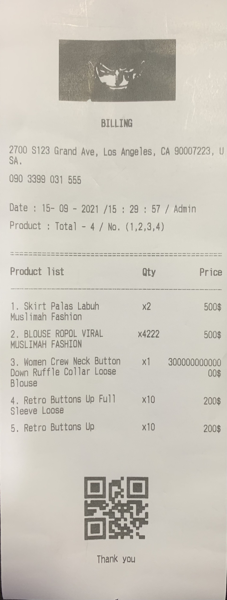
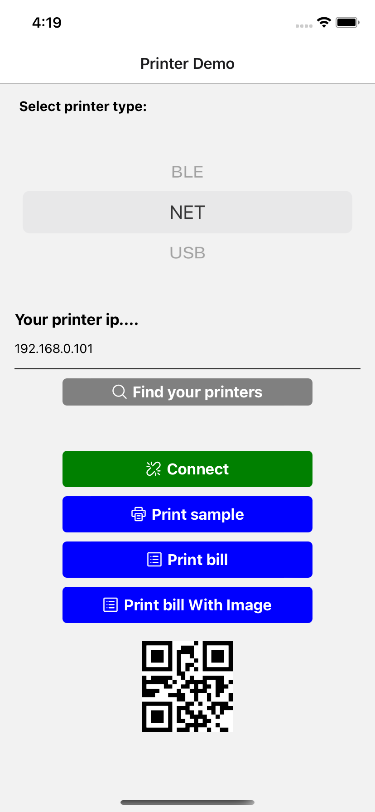

# react-native-thermal-receipt-printer-image-qr


- I fork this for my quickly project, this is not the official project.
- Fork of `react-native-thermal-receipt-printer` and add implement :
<br />

| Implement    | Android            | IOS                |
| ---------- | ------------------ | ------------------ |
| Image & QR (URL & Base64) | :heavy_check_mark: | :heavy_check_mark: |
| Fix cut | :heavy_check_mark: | :heavy_check_mark: |
| Print With Column | :heavy_check_mark: | :heavy_check_mark: |
| NET Connect Timeout | :heavy_check_mark: | :heavy_check_mark: |

:grey_exclamation:**`Print Image & QR with bluetooth in IOS just implement not tested yet`**

## Support

| Printer    | Android            | IOS                |
| ---------- | ------------------ | ------------------ |
| USBPrinter | :heavy_check_mark: |                    |
| BLEPrinter | :heavy_check_mark: | :heavy_check_mark: |
| NetPrinter | :heavy_check_mark: | :heavy_check_mark: |

<br />
<div style="display: flex; flex-direction: row; align-self: center; align-items: center">


</div>

## Installation
```
npm i react-native-thermal-receipt-printer-image-qr
npm i react-native-ping
```
or
```
yarn add react-native-thermal-receipt-printer-image-qr
yarn add react-native-ping
```
next step
```
# RN >= 0.60
cd ios && pod install

# RN < 0.60
react-native link react-native-thermal-receipt-printer-image-qr
```

## API Reference
```tsx
    init: () => Promise;
    getDeviceList: () => Promise;
    /**
     * `timeout`
     * @default 4000ms
     */
    connectPrinter: (host: string, port: number, timeout?: number | undefined) => Promise;
    closeConn: () => Promise;
    /**
     * Print text
     */
    printText: (text: string, opts?: {}) => void;
    /**
     * Print text & end the bill & cut
     */
    printBill: (text: string, opts?: PrinterOptions) => void;
    /**
     * print with image url
     */
    printImage: (imgUrl: string, opts?: PrinterImageOptions) => void;
    /**
     * Base 64 string
     */
    printImageBase64: (Base64: string, opts?: PrinterImageOptions) => void;
    /**
     * Only android print with encoder
     */
    printRaw: (text: string) => void;
    /**
     * print column
     * 80mm => 46 character
     * 58mm => 30 character
     */
    printColumnsText: (texts: string[], columnWidth: number[], columnAliment: ColumnAliment[], columnStyle?: string[], opts?: PrinterOptions) => void;
```

## Styling
```js
import {
  COMMANDS
} from 'react-native-thermal-receipt-printer-image-qr';
```
[See more here](https://github.com/thiendangit/react-native-thermal-receipt-printer-image-qr/blob/main/dist/utils/printer-commands.js)

## Example
**`Print Columns Text`**
```tsx
const BOLD_ON = COMMANDS.TEXT_FORMAT.TXT_BOLD_ON;
const BOLD_OFF = COMMANDS.TEXT_FORMAT.TXT_BOLD_OFF;
let orderList = [
  ["1. Skirt Palas Labuh Muslimah Fashion", "x2", "500$"],
  ["2. BLOUSE ROPOL VIRAL MUSLIMAH FASHION", "x4222", "500$"],
  ["3. Women Crew Neck Button Down Ruffle Collar Loose Blouse", "x1", "30000000000000$"],
  ["4. Retro Buttons Up Full Sleeve Loose", "x10", "200$"],
  ["5. Retro Buttons Up", "x10", "200$"],
];
let columnAliment = [ColumnAliment.LEFT, ColumnAliment.CENTER, ColumnAliment.RIGHT];
let columnWidth = [46 - (7 + 12), 7, 12]
const header = ['Product list', 'Qty', 'Price']
Printer.printColumnsText(header, columnWidth, columnAliment, [`${BOLD_ON}`, '', '']);
for (let i in orderList) {
  Printer.printColumnsText(orderList[i], columnWidth, columnAliment, [`${BOLD_OFF}`, '', '']);
}
Printer.printBill(`${CENTER}Thank you\n`);
```

**`Print image`**
```tsx
Printer.printImage('https://media-cdn.tripadvisor.com/media/photo-m/1280/1b/3a/bd/b5/the-food-bill.jpg', {
imageWidth: 575,
// imageHeight: 1000,
/* only ios */
// paddingX: 100
})
```
[See more here](https://github.com/thiendangit/react-native-thermal-receipt-printer-image-qr/blob/main/example/src/HomeScreen.tsx)

## Troubleshoot

- when install in `react-native` version >= 0.60, xcode show this error

```
duplicate symbols for architecture x86_64
```

that because the .a library uses [CocoaAsyncSocket](https://github.com/robbiehanson/CocoaAsyncSocket) library and Flipper uses it too

_Podfile_

```diff
...
  use_native_modules!

  # Enables Flipper.
  #
  # Note that if you have use_frameworks! enabled, Flipper will not work and
  # you should disable these next few lines.
  # add_flipper_pods!
  # post_install do |installer|
  #   flipper_post_install(installer)
  # end
...
```

and comment out code related to Flipper in `ios/AppDelegate.m`
