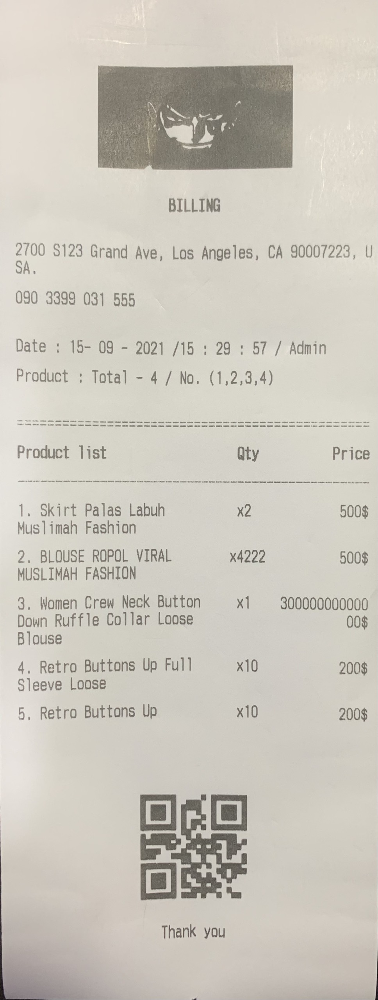
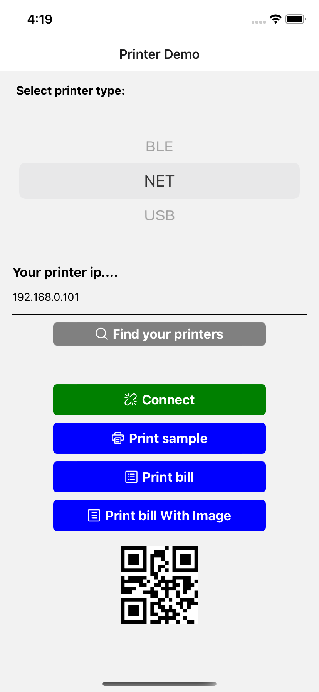

# react-native-thermal-receipt-printer-image-qr


A React Native library for thermal receipt printing with support for USB, BLE, and Network printers. This is a fork of [`react-native-thermal-receipt-printer`](https://www.npmjs.com/package/react-native-thermal-receipt-printer) with additional features:

## 🆕 Features Added

| Feature                  | Android | iOS |
| ------------------------ | ------- | --- |
| Image & QR Printing      | ✅      | ✅  |
| Base64 Image Support     | ✅      | ✅  |
| Fixed Paper Cutting      | ✅      | ✅  |
| Column Text Printing     | ✅      | ✅  |
| Network Connection Check | ✅      | ✅  |

> **Note**: Image & QR printing with Bluetooth on iOS is implemented but not yet tested.

## 🖨️ Printer Support

| Connection Type | Android | iOS |
| --------------- | ------- | --- |
| USB Printer     | ✅      |     |
| BLE Printer     | ✅      | ✅  |
| Network Printer | ✅      | ✅  |

<br />
<div style="display: flex; flex-direction: row; align-self: center; align-items: center">


</div>

## 📦 Installation

```bash
npm install react-native-thermal-receipt-printer-image-qr
```

or

```bash
yarn add react-native-thermal-receipt-printer-image-qr
```

### Next Steps

```bash
# For React Native >= 0.60
cd ios && pod install

# For React Native < 0.60
react-native link react-native-thermal-receipt-printer-image-qr
```

> **Note**: This library no longer requires `react-native-ping` as a dependency. Network connection validation is now handled internally.

## 🔧 API Reference

```typescript
interface PrinterAPI {
	// Initialize printer
	init(): Promise<void>;

	// Get available devices
	getDeviceList(): Promise<any[]>;

	// Network printer connection
	connectPrinter(host: string, port: number, timeout?: number): Promise<void>;
	closeConn(): Promise<void>;

	// Text printing
	printText(text: string, opts?: object): void;
	printBill(text: string, opts?: PrinterOptions): void;

	// Image printing
	printImage(imgUrl: string, opts?: PrinterImageOptions): void;
	printImageBase64(Base64: string, opts?: PrinterImageOptions): void;

	// Raw printing (Android only)
	printRaw(text: string): void;

	// Column text printing
	printColumnsText(
		texts: string[],
		columnWidth: number[],
		columnAlignment: ColumnAlignment[],
		columnStyle?: string[],
		opts?: PrinterOptions,
	): void;
}
```

## 🎨 Styling & Commands

```typescript
import {
	COMMANDS,
	ColumnAlignment,
	PrinterOptions,
	PrinterImageOptions,
} from "react-native-thermal-receipt-printer-image-qr";

// Text formatting commands
const BOLD_ON = COMMANDS.TEXT_FORMAT.TXT_BOLD_ON;
const BOLD_OFF = COMMANDS.TEXT_FORMAT.TXT_BOLD_OFF;
const ALIGN_CENTER = COMMANDS.ALIGN.CENTER;
const ALIGN_LEFT = COMMANDS.ALIGN.LEFT;
const ALIGN_RIGHT = COMMANDS.ALIGN.RIGHT;

// Column alignment options
enum ColumnAlignment {
	LEFT = 0,
	CENTER = 1,
	RIGHT = 2,
}
```

[See all available commands](https://github.com/thiendangit/react-native-thermal-receipt-printer-image-qr/blob/main/dist/utils/printer-commands.js)

## 💡 Usage Examples

### Print Column Text

```typescript
import RNPrinter from "react-native-thermal-receipt-printer-image-qr";
import {
	COMMANDS,
	ColumnAlignment,
} from "react-native-thermal-receipt-printer-image-qr";

const BOLD_ON = COMMANDS.TEXT_FORMAT.TXT_BOLD_ON;
const BOLD_OFF = COMMANDS.TEXT_FORMAT.TXT_BOLD_OFF;

const orderList = [
	["1. Skirt Palas Labuh Muslimah Fashion", "x2", "500$"],
	["2. BLOUSE ROPOL VIRAL MUSLIMAH FASHION", "x4222", "500$"],
	[
		"3. Women Crew Neck Button Down Ruffle Collar Loose Blouse",
		"x1",
		"30000000000000$",
	],
	["4. Retro Buttons Up Full Sleeve Loose", "x10", "200$"],
	["5. Retro Buttons Up", "x10", "200$"],
];

const columnAlignment = [
	ColumnAlignment.LEFT,
	ColumnAlignment.CENTER,
	ColumnAlignment.RIGHT,
];

const columnWidth = [46 - (7 + 12), 7, 12]; // 80mm paper width
const header = ["Product list", "Qty", "Price"];

// Print header
RNPrinter.printColumnsText(header, columnWidth, columnAlignment, [
	`${BOLD_ON}`,
	"",
	"",
]);

// Print order items
for (const item of orderList) {
	RNPrinter.printColumnsText(item, columnWidth, columnAlignment, [
		`${BOLD_OFF}`,
		"",
		"",
	]);
}

// Print footer
RNPrinter.printBill(`${COMMANDS.ALIGN.CENTER}Thank you\n`);
```

### Print Image

```typescript
import RNPrinter from "react-native-thermal-receipt-printer-image-qr";

// Print image from URL
RNPrinter.printImage(
	"https://media-cdn.tripadvisor.com/media/photo-m/1280/1b/3a/bd/b5/the-food-bill.jpg",
	{
		imageWidth: 575,
		// imageHeight: 1000,
		// paddingX: 100
	},
);

// Print base64 image
const base64Image = "iVBORw0KGgoAAAANSUhEUgAA..."; // Your base64 string
RNPrinter.printImageBase64(base64Image, {
	imageWidth: 300,
});
```

### Network Printer Connection

```typescript
import RNPrinter from "react-native-thermal-receipt-printer-image-qr";

try {
	// Initialize
	await RNPrinter.init();

	// Connect to network printer (default port 9100)
	await RNPrinter.connectPrinter("192.168.1.100", 9100, 5000);

	// Print something
	RNPrinter.printText("Hello World!");

	// Close connection
	await RNPrinter.closeConn();
} catch (error) {
	console.error("Printer error:", error);
}
```

[See complete example](https://github.com/thiendangit/react-native-thermal-receipt-printer-image-qr/blob/main/example/src/HomeScreen.tsx)

## 🔧 Troubleshooting

### iOS Build Issues

When using React Native >= 0.60, you may encounter this error in XCode:

```
duplicate symbols for architecture x86_64
```

This occurs because the library uses [CocoaAsyncSocket](https://github.com/robbiehanson/CocoaAsyncSocket) which conflicts with Flipper.

**Solution:**

In your `ios/Podfile`, comment out or remove Flipper-related lines:

```diff
...
  use_native_modules!

- # Enables Flipper.
- #
- # Note that if you have use_frameworks! enabled, Flipper will not work and
- # you should disable these next few lines.
- add_flipper_pods!
- post_install do |installer|
-   flipper_post_install(installer)
- end
...
```

Also comment out Flipper code in `ios/AppDelegate.m`.

### Network Connection Issues

- Ensure the printer IP is accessible from your device
- Check that port 9100 is open on the printer
- Verify network firewall settings

### Android USB Issues

- Ensure USB debugging is enabled
- Check device permissions for USB access
- Some Android versions may require additional USB driver setup
